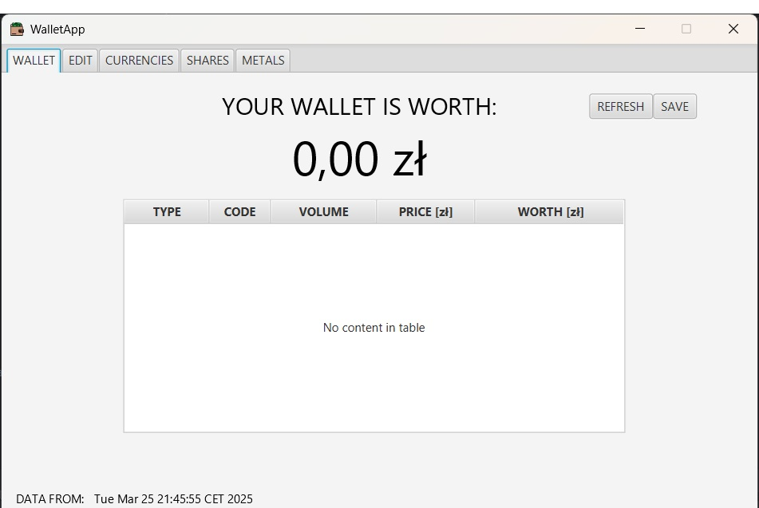
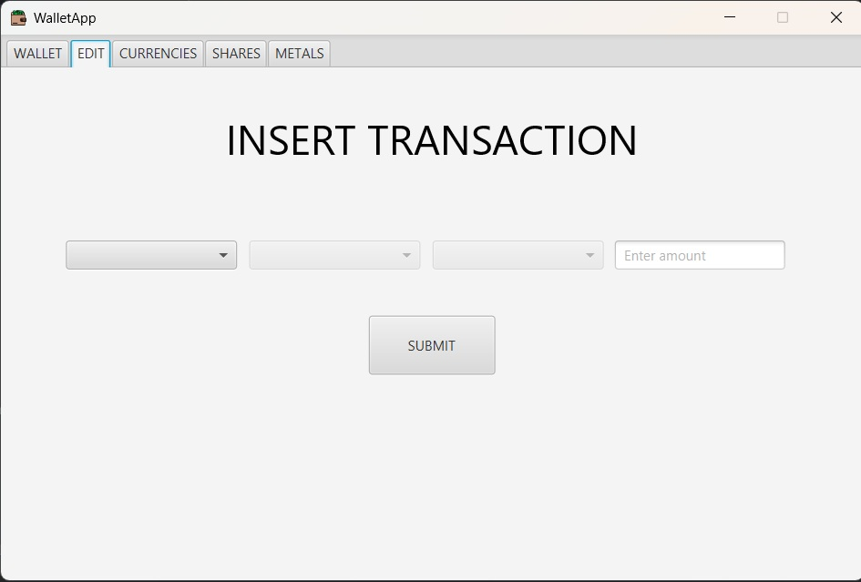
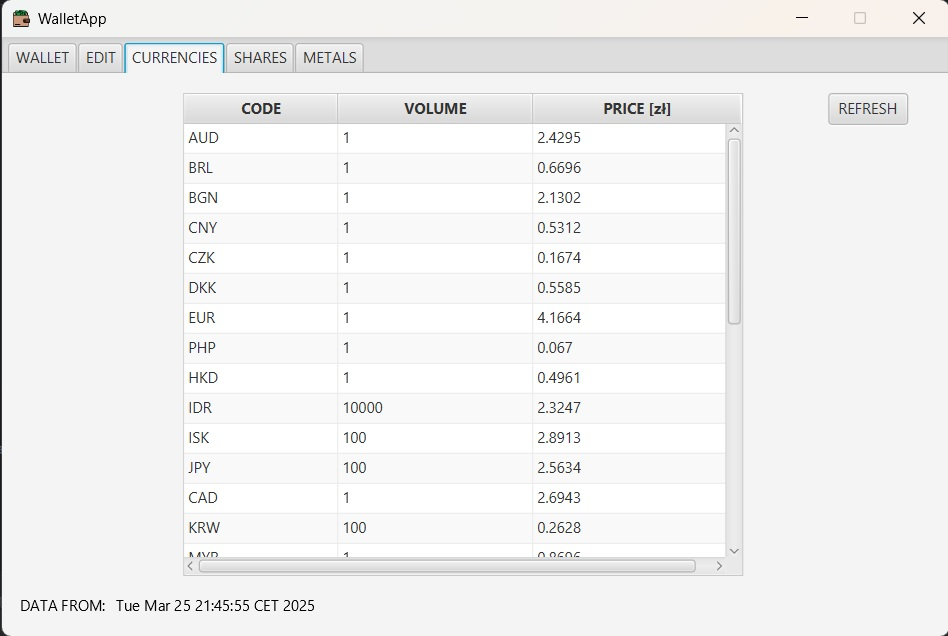
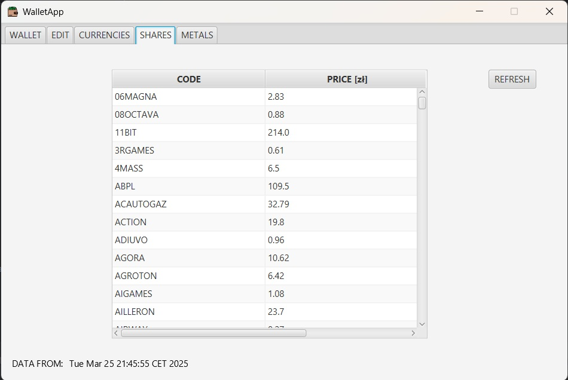
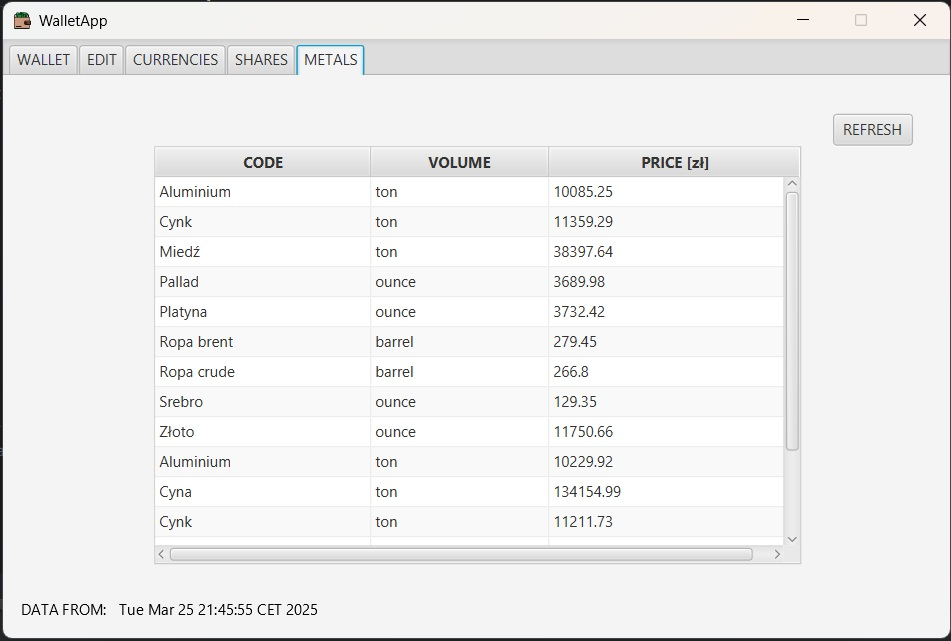
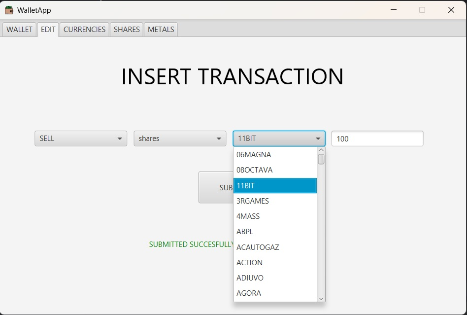
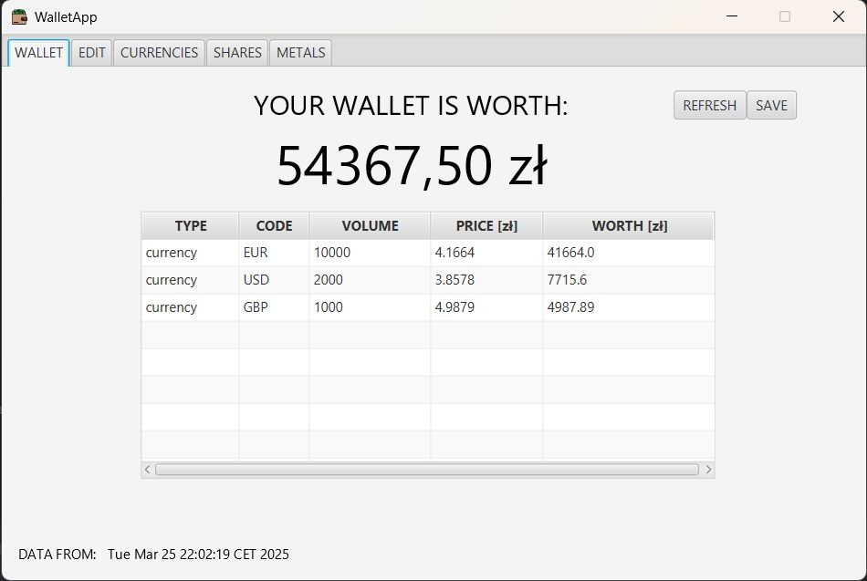

# WalletApp

## Description

**WalletApp** is a Java-based application that allows users to track and manage their assets, including stocks, currencies, and metals. The app fetches real-time data from various online sources to calculate the current value of the assets. You can add new entries, remove old ones, and view the updated value of your portfolio.

## Features

- **Add Assets**: Add new assets to your portfolio (e.g., stocks, currencies, metals).
- **Real-Time Value Calculation**: Fetches live price data from online sources to calculate the current value of your assets.
- **Delete Assets**: Remove assets from your portfolio.
- **Portfolio Management**: Keep track of all your assets and their values in one place.

## Incomplete Features

Please note that not all functionalities have been fully implemented yet. Some features might still be in development or might not be available at the moment.

## Technologies Used

- **Java**: The main programming language for building the application.
- **JavaFX**: Used for creating the graphical user interface (GUI).
- **SceneBuilder**: Helps design the app's user interface with drag-and-drop components.
- **Maven**: For project dependency management and building the application.

## Screenshots

